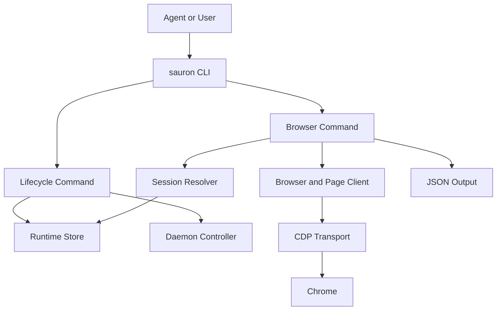
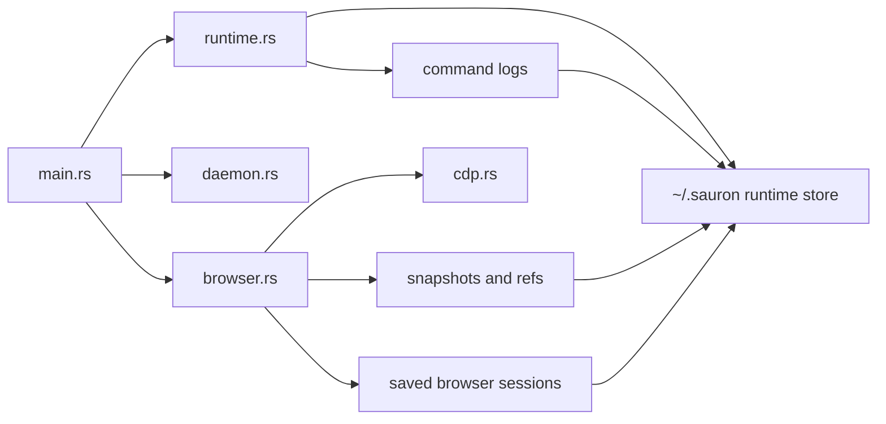

# Repository Guidelines

## Project Structure & Module Organization
Core code lives in `src/`. Entry point and CLI routing are in `src/main.rs`. Runtime/session lifecycle and backend storage are in `src/runtime.rs` (filesystem runtime store). Chrome process control is in `src/daemon.rs`, CDP transport in `src/cdp.rs`, and browser actions in `src/browser.rs`. Shared command/result types and errors are in `src/types.rs` and `src/errors.rs`.  
User-facing docs are in `README.md`. Build config is in `Cargo.toml`. npm distribution metadata lives in `package.json`, `distribution/targets.json`, and `bin/sauron.js`. GitHub release automation lives in `.github/workflows/release.yml`.

## Interaction & Data Flow Diagrams

## Build, Test, and Development Commands
- `cargo run -- --help`: run CLI locally and inspect command surface.
- `cargo check`: fast compile validation during iteration.
- `cargo test`: run unit tests (`#[cfg(test)]` modules).
- `cargo clippy --all-targets --all-features -- -D warnings`: enforce lint-clean code.
- `cargo build --release`: produce optimized binary used for final verification.
- `node scripts/release-version.mjs current`: confirm Cargo/npm release versions are synchronized.
- `npm pack --dry-run`: validate the scoped npm package after staging binaries into `npm/bin/`.

Use the full gate sequence before submitting changes: test, clippy, release build.

## Coding Style & Naming Conventions
Use standard Rust style with `rustfmt` formatting (`cargo fmt --all`).  
Naming:
- `snake_case` for functions/modules/variables.
- `PascalCase` for structs/enums.
- `SCREAMING_SNAKE_CASE` for error code serialization and constants.

Prefer small, focused functions and explicit error mapping via `CliError`. Keep the v2 JSON output contract stable across all commands.

## Testing Guidelines
Tests are currently module-local (for example in `src/context.rs`, `src/runtime.rs`). Add tests near modified logic.  
For code touching environment variables in tests, reuse shared locking (`src/test_support.rs`) to avoid cross-test races.  
At minimum, cover:
- lifecycle transitions (`runtime start`/`runtime stop`),
- session lookup/validation behavior,
- failure-path regressions introduced by your change.

## Commit & Pull Request Guidelines
Recent history favors short, imperative summaries (for example: `optimising session management`, `remove old Bun/TS files and target/ build artifacts`). Follow that style and keep subject lines specific.  
PRs should include:
- what changed and why,
- commands run (`cargo test`, `cargo clippy ...`, `cargo build --release`),
- any CLI behavior changes (flags, output, lifecycle semantics),
- README updates when user-facing workflow changes.

## Security & Configuration Notes
Do not commit runtime artifacts from `target/` or local session state under `~/.sauron/`.  
Prefer environment variables for configuration (for example `SAURON_HOME`) and avoid hardcoding credentials.

## JJ Workspace Safety
Before moving `main` to a workspace-derived change, verify ancestry and tree impact with `jj diff --from main --to <rev> --summary` to catch accidental whole-tree deletions from mis-rooted workspaces.
