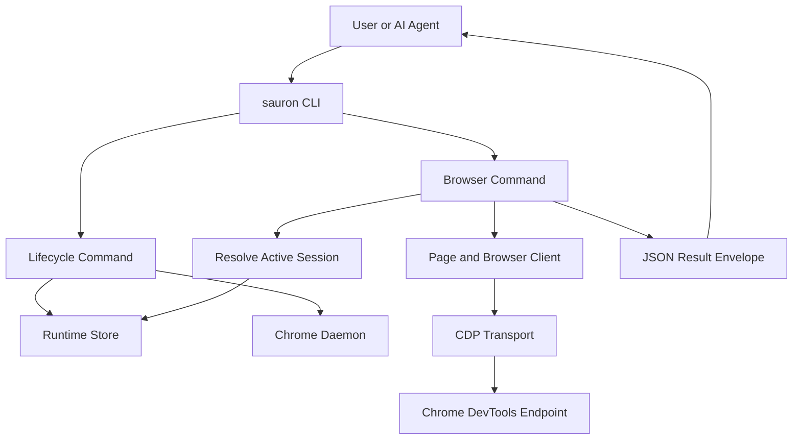
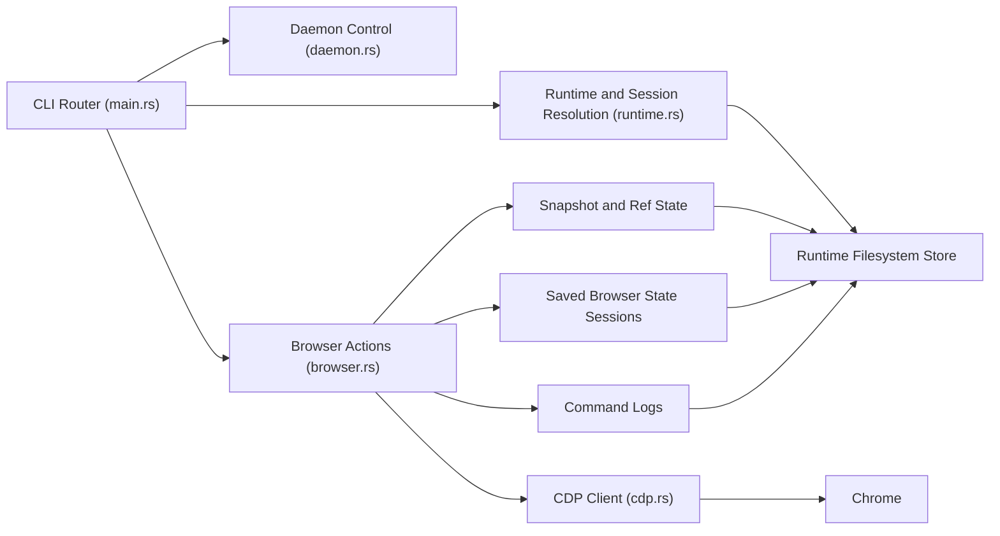

# sauron (Rust)

A fully Rust-native CLI for AI agents to control Chrome via the **Chrome DevTools Protocol (CDP)**.

This is a rewrite of the attached Bun/TypeScript `sauron` project as a compiled Rust binary.

## Goals

- **Agent-friendly** JSON output for all commands (v2 envelope)
- **Fast** startup and execution (single static-ish binary)
- **Process-safe concurrency** with mandatory runtime sessions (`start` before browser commands)
- **Per-session isolation** with generated `session_id`, `instance`, and `client` IDs by default
- Filesystem-only runtime state storage under `~/.sauron/runtime/`
- Uses Chrome **`--headless=new`** only (opinionated headless runtime)
- Default viewport is **1440x900** (override with `--viewport WIDTHxHEIGHT`)

## V2 Interface

- `v2` is the only supported interface.
- No backward compatibility layer for v1 command names or output shape.
- Migration and implementation notes: [specs/v2-integration.md](/Users/mish/projects/sauron/specs/v2-integration.md)

## Install

```bash
./install.sh
```

By default, `install.sh`:
- builds and installs for your host target to `/usr/local/bin/sauron`,
- attempts to build the release matrix for:
  - `aarch64-apple-darwin`
  - `x86_64-apple-darwin`
  - `x86_64-unknown-linux-gnu`

Notes:
- Linux cross-builds from non-Linux hosts require `zig` and `cargo-zigbuild`.
- Missing cross-toolchain prerequisites are reported as warnings and skipped; host install still succeeds.

Useful options:

```bash
./install.sh --no-matrix                     # host-only build + install
./install.sh --prefix "$HOME/.local"         # install under custom prefix
./install.sh --windows                       # best-effort Windows build too
```

If you prefer the old local cargo install workflow:

```bash
cargo install --path .
```

Or run in place:

```bash
cargo run -- --help
```

Or install the published npm package:

```bash
npm install -g @nothumanwork/sauron
```

The npm package bundles prebuilt binaries for:
- `x86_64-unknown-linux-gnu`
- `x86_64-apple-darwin`
- `aarch64-apple-darwin`

The `sauron` launcher inside the package selects the matching binary for the current host OS and architecture at runtime.

## Quick start

Start a runtime session before browser commands:

```bash
sauron runtime start
```

macOS defaults to GPU + WebGL on `runtime start` (opt out with `--no-webgl --no-gpu`).

Then run browser commands from the same project directory. Later `sauron` invocations can reuse that session from separate subprocesses in the same shell or agent workflow:

```bash
sauron page goto https://example.com
sauron page snapshot --format json
sauron input click --ref @e1
sauron page screenshot --responsive --quality medium
```

Clean up with:

```bash
sauron runtime stop
```

## Mandatory session lifecycle

- Most non-`runtime start` commands require an active runtime session. `runtime status` is the exception: it can also report `stopped` when no active session exists.
- Session resolution order is:
  - explicit `--session-id`
  - current process binding
  - current project binding
  - `SAURON_SESSION_ID` fallback
- If none resolve to an active session, commands that need one fail with `SESSION_REQUIRED`.
- `start` auto-generates:
  - `session_id` (`sess-...`)
  - `instance` (`inst-...`)
  - `client` (`client-...`)
- You can still override IDs:

```bash
sauron --session-id mysession --instance work --client alice runtime start
```

## Interaction Flow



## Component Data Flow



## Concurrent session workflow

Terminal A:

```bash
sauron runtime start
sauron page goto https://example.com
sauron state save logged-in
```

Terminal B (independent shell/process):

```bash
sauron runtime start
sauron page goto https://news.ycombinator.com
sauron state save baseline
```

Both sessions are isolated and can run concurrently without conflicts.

If you previously exported `SAURON_SESSION_ID`, clear it to avoid overriding project-aware routing:

```bash
unset SAURON_SESSION_ID
```

## Runtime state

Runtime session state is stored on the local filesystem under `~/.sauron/runtime/`.
After `runtime stop` or `runtime cleanup`, `sauron runtime status` reports `stopped`.

## Session logs

Each session writes NDJSON logs to:

`~/.sauron/runtime/logs/<session_id>.ndjson`

Each line includes timestamp, session metadata, command name, status, and error details when present.

## CLI flag placement

Global flags (`--session-id`, `--port`, etc.) must be placed before the subcommand:

```bash
sauron --session-id mysession page goto https://example.com
```

`--viewport` is global and applies to `start` and browser commands:

```bash
sauron --viewport 1440x900 runtime start
sauron --viewport 390x844 page screenshot
```

## Output contract

All commands return exactly one JSON object in a unified v2 envelope:

- Success:

```json
{
  "meta": { "requestId": "...", "timestamp": "...", "durationMs": 12 },
  "result": { "ok": true, "command": "page.snapshot", "data": { /* ... */ } }
}
```

- Error:

```json
{
  "meta": { "requestId": "...", "timestamp": "...", "durationMs": 9 },
  "result": {
    "ok": false,
    "command": "input.click",
    "error": {
      "code": "ELEMENT_NOT_FOUND",
      "message": "...",
      "hint": "...",
      "recoverable": true,
      "exitCode": 1,
      "category": "state"
    }
  }
}
```

## Notes

- You need a local Chrome/Chromium install.
- The daemon uses `--remote-debugging-port=<port>`.

## Automated Releases

Pushes to `main` cut the next patch version automatically. GitHub Actions then:

- builds the release binaries on GitHub-hosted Linux and macOS runners,
- stages them into the scoped npm package `@nothumanwork/sauron`,
- publishes the npm package,
- tags the repository with `v<version>`, and
- creates the matching GitHub release with per-target tarballs.

The release version is kept in sync across `Cargo.toml`, `Cargo.lock`, and `package.json`.
